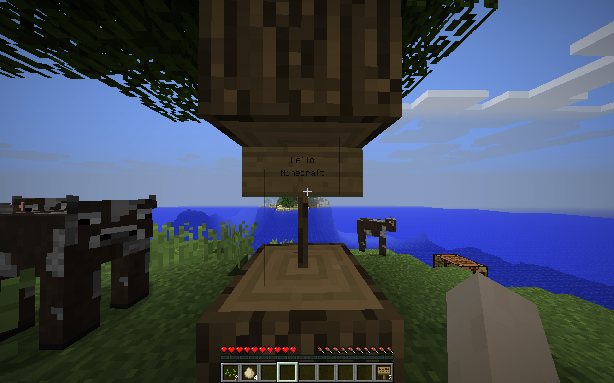

此教程中的所有示例镜像都在
https://github.com/lulaide/docker-example/

## Volume 存储卷


Volume 是 Docker 官方管理的“持久化存储机制”，用来保存容器生命周期之外仍然保留的数据，例如数据库、日志、文件存储等。

> 容器删了 → 数据还在
> 容器更新、重建 → 数据不丢

Volume 是 Docker 推荐的数据持久化方式，比 bind mount 更安全、更便携，且可跨容器共享。

Volume 三种类型:

### Named Volume（命名卷）——最常用
由 Docker 管理，默认存储在:

```bash
/var/lib/docker/volumes/<volume_name>/_data/
```

创建命名卷
```bash
docker volume create <volume_name>
```

查看所有卷
```bash
docker volume ls
```
删除卷
```bash
docker volume rm <volume_name>
```

这里使用一个 Minecraft 服务器利用 Volume 来保存 主世界地图 的例子:

创建储存卷
```bash
docker volume create mc_world
```
运行 Minecraft 容器，并挂载储存卷
```bash
docker run -itd -p 25565:25565 -v mc_world:/app/world --name mc1.12.2 ghcr.io/lulaide/paper:1.12.2
```

进入游戏后对世界进行一些修改，然后关闭服务器。


```bash
docker stop mc1.12.2
```

现在查看一下储存卷中的数据:
```bash
docker volume inspect mc_world
```

输出如下

```json
[
    {
        "CreatedAt": "2025-xx-xxTxx:xx:xx+08:00",
        "Driver": "local",
        "Labels": null,
        "Mountpoint": "/var/lib/docker/volumes/mc_world/_data",
        "Name": "mc_world",
        "Options": null,
        "Scope": "local"
    }
]
```

此目录内的内容即为 Minecraft 世界数据，原本 world 目录下的文件都在这里:

```bash
$ ls /var/lib/docker/volumes/mc_world/_data
advancements  data  level.dat  level.dat_old  playerdata  region  session.lock  stats  uid.dat
```

现在我们把游戏版本换为1.21.1，重新运行容器，并挂载同一个储存卷:
```bash
docker run -itd -p 25565:25565 -v mc_world:/app/world --name mc1.21.1 ghcr.io/lulaide/paper:1.21.1
```

再次进入游戏，发现之前的世界数据都还在，并且版本已经升级到 1.21.1 了:


关闭服务器
```bash
docker stop mc1.21.1
```
删除容器
```bash
docker rm mc1.21.1
```
可以看到储存卷中的数据依然存在:
```bash
$ ls /var/lib/docker/volumes/mc_world/_data
advancements  data  datapacks  entities  level.dat  level.dat_old  paper-world.yml  playerdata  region  session.lock  stats  uid.dat
```

特点：
- 自动管理路径
- 跨容器共享
- 容器删除不会删除卷

### Anonymous Volume（匿名卷）
及其不推荐使用匿名卷，因为无法轻易管理和定位数据。
匿名卷是没有命名的 Volume，Docker 会自动分配一个随机名称。只有两种情况会出现匿名卷:
#### 镜像里写了 VOLUME 指令
这里以官方的 MySQL 镜像为例:

```bash
docker run --rm -e MYSQL_ROOT_PASSWORD=root mysql:latest
```

运行前只有一个卷:
```bash
$ docker volume ls
DRIVER    VOLUME NAME
local     mc_world
```

运行后会多出一个匿名卷:
```bash
$ docker volume ls
DRIVER    VOLUME NAME
local     ed7410e0fe487b6b96975b935d6908e2cf3a2448983af184e2794a9e7c1fe8a2
local     mc_world
```

这里储存这数据库数据

```bash
$ ls /var/lib/docker/volumes/ed7410e0fe487b6b96975b935d6908e2cf3a2448983af184e2794a9e7c1fe8a2/_data
auto.cnf        ca-key.pem       '#ib_16384_0.dblwr'   ibtmp1          mysql.ibd               private_key.pem   sys
binlog.000001   ca.pem           '#ib_16384_1.dblwr'  '#innodb_redo'   mysql.sock              public_key.pem    undo_001
binlog.000002   client-cert.pem   ib_buffer_pool      '#innodb_temp'   mysql_upgrade_history   server-cert.pem   undo_002
binlog.index    client-key.pem    ibdata1              mysql           performance_schema      server-key.pem
```

更推荐的做法是使用命名卷，自己创建并挂载到容器中:
```bash
docker volume create mysql_data
docker run -d -e MYSQL_ROOT_PASSWORD=root -v mysql_data:/var/lib/mysql mysql:latest
``` 

#### 运行容器时使用 -v 或 --volume 但没有指定卷名

创建匿名卷
```bash
docker run -v /app/ --rm ubuntu sh -c 'echo "Anonymous Volume" > /app/output.txt'
```

查看有哪些卷
```bash
docker volume ls
```

你会发现多了一个名字一长串的卷：
```bash
DRIVER    VOLUME NAME
local     4878daef9a83732adc44a771a5cd82a8a2730ea567a229487a4cbbcac4354fed
local     mc_world
```

我们写入的 output.txt 文件的确保存在这个卷下。
```bash
cat /var/lib/docker/volumes/4878daef9a83732adc44a771a5cd82a8a2730ea567a229487a4cbbcac4354fed/_data/output.txt
Anonymous Volume
```

### Host Bind Mount（绑定挂载）

直接把宿主的目录挂载到容器中:

```bash
docker run -v /path/on/host:/path/in/container ...
```

这种方式更灵活，可以直接访问宿主机的文件系统，但需要注意权限和路径问题。
简单理解：

> 容器内看到的路径 = 宿主机真实文件
> 修改任意一边 = 两边实时同步

Bind Mount 不属于 Docker Volume，它属于 Linux 内核的 bindfs（bind mount）机制。
当你执行：
```bash
-v /host:/container
```

Docker 并没有移动文件，也没有创建卷，只做了一件事：
宿主机 /host 映射为容器中的 /container
这部分行为在 namespace + mount namespace 下实现。